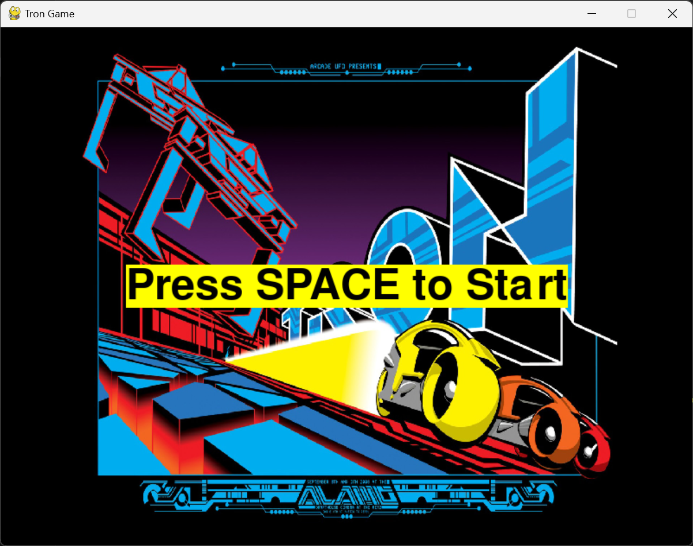
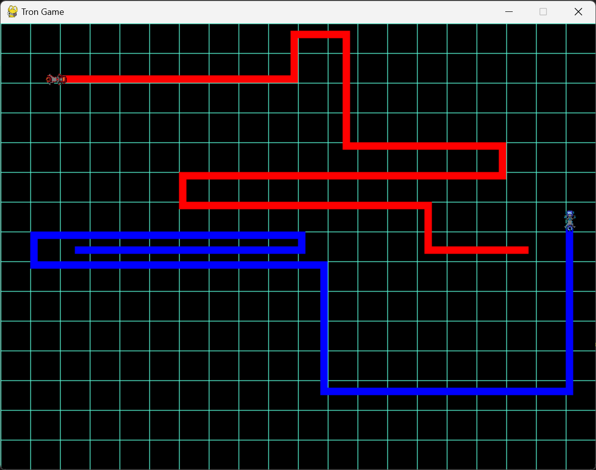
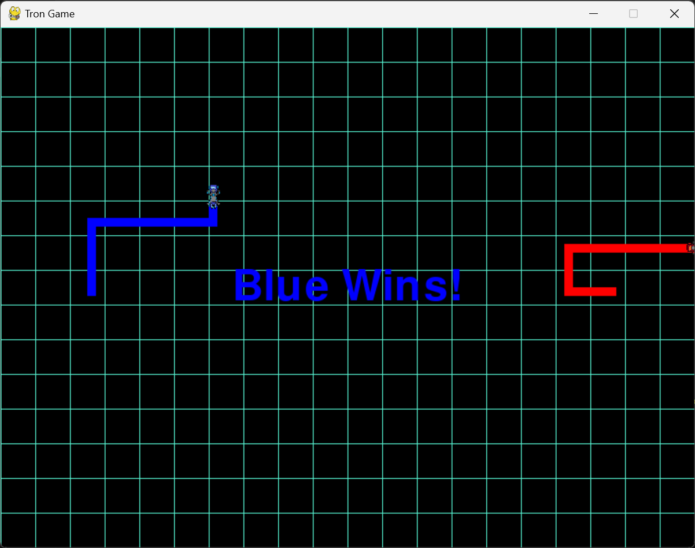
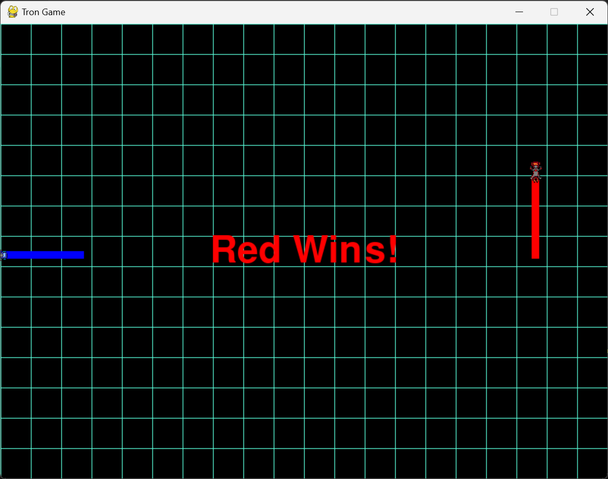
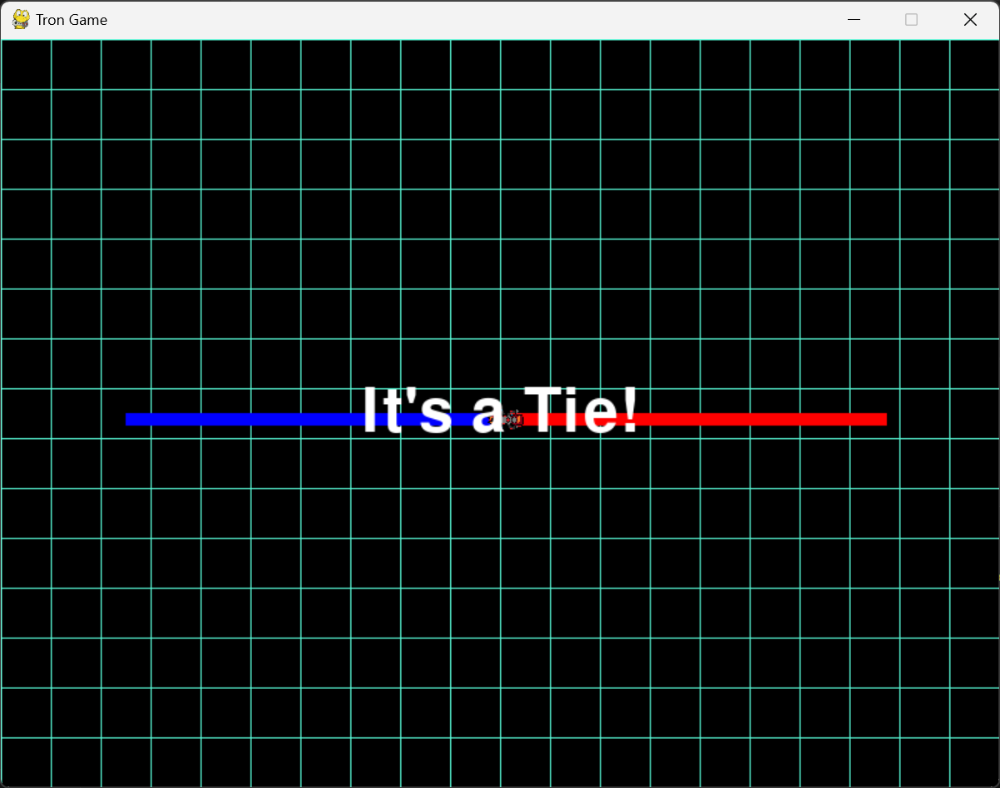

# Tron Game

This is a simple Tron-inspired game built using Python and Pygame. The game features two players controlling their own "light cycles" on a grid. The goal is to avoid crashing into walls or each other's trails.

## Demo








## [<u>Tron Demo Video</u>](demo/tron_demo.mp4)

## Features

- Two-player mode with distinct controls.
- Grid-based movement with collision detection.
- Background music and sound effects.

## Installation

### Prerequisites

- Python 3.6.11 or higher
- [Pygame](https://www.pygame.org/) library

### Setup

#### Windows

1. **Clone the repository:**

   ```bash
   git clone https://github.com/sayhan1610/tron.git
   cd tron
   ```

2. **Run the batch script to set up and run the game:**
   ```bash
   setup_and_run.bat
   ```

#### Linux/Mac

1. **Clone the repository:**

   ```bash
   git clone https://github.com/sayhan1610/tron.git
   cd tron
   ```

2. **Make the bash script executable:**

   ```bash
   chmod +x setup_and_run.sh
   ```

3. **Run the bash script to set up and run the game:**
   ```bash
   ./setup_and_run.sh
   ```

## Usage

- **Start the game**: After running the setup script, the game will start automatically.
- **Controls**:
  **Player 1 (Blue)**:
  `W` - Move Up
  `S` - Move Down
  `A` - Move Left
  `D` - Move Right
  **Player 2 (Red)**:
  `UP` - Move Up
  `DOWN` - Move Down
  `LEFT` - Move Left
  `RIGHT` - Move Right
- **Start/Restart the Game**: Press `SPACE`.
- **Show Instructions**: Press `I`.
- **Quit Game**: Press `ESC`.

## Files

- `main.py`: The main Python script for running the game.
- `images/`: Directory containing image assets for the game.
- `audio/`: Directory containing audio files for the game.
- `setup_and_run.bat`: Batch script for setting up and running the game on Windows.
- `setup_and_run.sh`: Bash script for setting up and running the game on Linux/Mac.

## Contributing

1. **Fork the repository**: Click the "Fork" button at the top right of the repository page.
2. **Create a new branch**: `git checkout -b my-feature-branch`
3. **Make your changes**: Edit files and add features.
4. **Commit your changes**: `git commit -am 'Add some feature'`
5. **Push to the branch**: `git push origin my-feature-branch`
6. **Create a pull request**: Go to the original repository and click "New Pull Request".

## License

This project is licensed under the MIT License - see the [LICENSE](LICENSE) file for details.

## Acknowledgements

- Inspired by Zach Latta's SSH Tron Game ([GitHub](https://github.com/zachlatta/sshtron))
